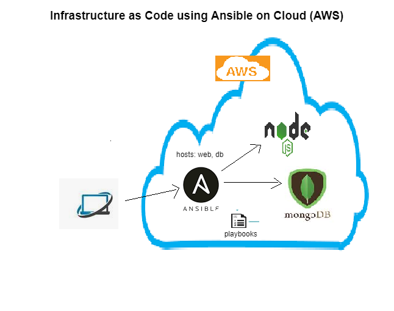

# Infrastructure as Code with Ansible on prem, hybrid and public cloud 


## task
## We have successfully implemented on   and   already
### Time to move on migrating everything to AWS now

#### Task

- Migrate Hybrid cloud infrastructure to AWS
- Create an Ansible controller on ec2 instance
`Create an ec2 instance on cloud name it as ansible_controller`
`ssh into ansible_controller from the local machine`
* run the provisioning scripts as below to install dependencies
`
sudo apt update
sudo apt-get install tree -y
sudo apt-add-repository --yes --update ppa:ansible/ansible
sudo apt install ansible -y
sudo apt install python3-pip - Python Package Manager
pip3 install awscli
pip3 install boto boto3
`
* Storing keys with Ansible Vault
`
ansible-vault create aws_keys.yml 
	aws_access_key: THISISMYACCESSKEY
	aws_secret_key: THISISMYSECRETKEY
`

- Creating 2 machines (for the webapp and the mongodb) on EC2 with playbooks
```
  GNU nano 2.9.3                                               ec2_launch.yml

- hosts: localhost
  connection: local
  gather_facts: True
  become: True

  vars:
    key_name: eng89_ansible_controller
    region: eu-west-1
    image: ami-038d7b856fe7557b3
    id: "eng89_Prathima_Ansible_apptesting1"
    sec_group: "sg-0e4a4d95cfa2c3ec0"
    subnet_id: "subnet-00ac052b1e40c0164"
    ansible_python_interpreter: /usr/bin/python3

  tasks:
    - name: Provisioning EC2 instances
      block:

      - name: Upload public key to AWS
        ec2_key:
          name: "{{ key_name }}"
          key_material: "{{ lookup('file', '~/.ssh/{{ key_name }}.pub') }}"
          region: "{{ region }}"
          aws_access_key: "{{aws_access_key}}"
          aws_secret_key: "{{aws_secret_key}}"

      - name: Provision instance(s)
        ec2:
          aws_access_key: "{{aws_access_key}}"
          aws_secret_key: "{{aws_secret_key}}"
          assign_public_ip: true
          key_name: "{{ key_name }}"
          id: "{{ id }}"
          group_id: "{{ sec_group }}"
          vpc_subnet_id: "{{ subnet_id }}"
          image: "{{ image }}"
          instance_type: t2.micro
          region: "{{ region }}"
          wait: true
          count: 1
          # exact_count: 2
          instance_tags:
            Name: eng89_prathima_ansi_testapp1

      tags: ['never', 'ec2_launch']
``` 
- add the ec2 instaces of the webapp and the mongodb servers onto the /etc/ansible/hosts
```
[web]
ec2-instance ansible_host=34.243.52.208 ansible_user=ubuntu ansible_ssh_private_key_file=~/.ssh/eng89_ansible_controller.pem

[db]
ec2-instance ansible_host=34.245.64.47 ansible_user=ubuntu ansible_ssh_private_key_file=~/.ssh/eng89_ansible_controller.pem

```

- Provisioning one with the webapp

```
# app_provision.yml

# This is a YAML file to install nginx onto oue web VM using YAML
---


- name: start mongodb
  import_playbook: mongodb_setup.yml


# where do we want to install


#  tasks:
- name: Install nginx
  import_playbook: nginx_setup.yml


# Install node js and NPM

- hosts: web
  gather_facts: true
  become: true


  tasks:
  - name: Install nodejs
    apt: pkg=nodejs state=present

  - name: Install NPM
    apt: pkg=npm state=present

  - name: download latest npm + Mongoose
    shell: |
      npm install -g npm@latest
      npm install mongoose -y
# Downloading pm2
  - name: Install pm2
    npm:
      name: pm2
      global: yes


  - name: seed + run app
    shell: |
      cd app/
      npm install
      node seeds/seed.js
      pm2 kill
      pm2 start app.js
    environment:
# This is where you enter the environment variable to tell the app where to look for the db
      DB_HOST: mongodb://ubuntu@172.31.41.158:27017/posts?authSource=admin #mongodb IP
    become_user: ubuntu

```
- provisioning one with mongodb
```
#mongodb_setup.yml

---

- hosts: db

  gather_facts: yes

  become: true

  tasks:
  - name: install mongodb
    apt: pkg=mongodb state=present

  - name: Remove mongodb file (delete file)
    file:
      path: /etc/mongodb.conf
      state: absent

  - name: Touch a file, using symbolic modes to set the permissions (equivalent to 0644)
    file:
      path: /etc/mongodb.conf
      state: touch
      mode: u=rw,g=r,o=r


  - name: Insert multiple lines and Backup
    blockinfile:
      path: /etc/mongodb.conf
      block: |
        # mongodb.conf
        storage:
          dbPath: /var/lib/mongodb
          journal:
            enabled: true
        systemLog:
          destination: file
          logAppend: true
          path: /var/log/mongodb/mongod.log
        net:
          port: 27017
          bindIp: 0.0.0.0
  - name: Restart mongodb
    become: true
    shell: systemctl restart mongodb

  - name: enable mongodb
    become: true
    shell: systemctl enable mongodb

  - name: start mongodb
    become: true
    shell: systemctl start mongodb

```
- Provision Configuration of environment variables (DB_HOST & config files and others) 
```

```

#### Deliverables 

- Record Video:
 - what is infra structure as code and Ansible
 - what is on prem, hybrid and public cloud infrastructure and pros and cons (create a diagram for on prem, hybrid and public cloud) 
 - Ansible Basics and workings
 - Ansible multiple hosts running playbook
 - Woking app with db in AWS cloud
  
